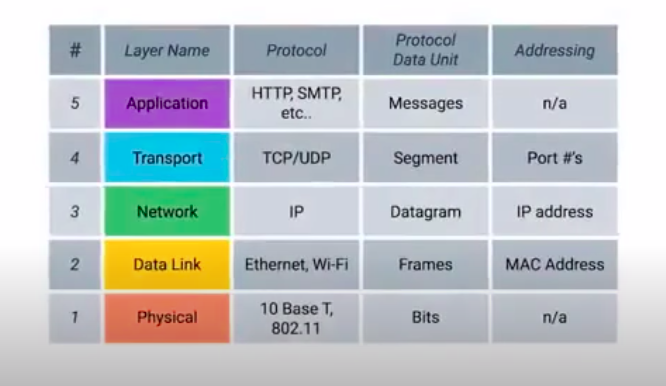
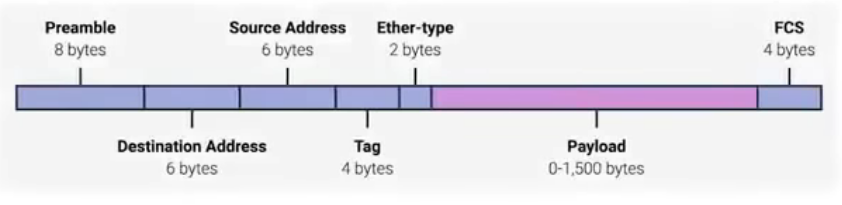
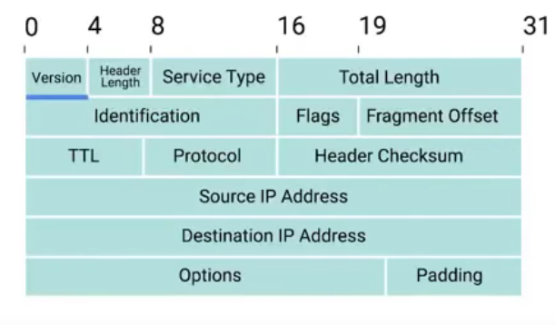
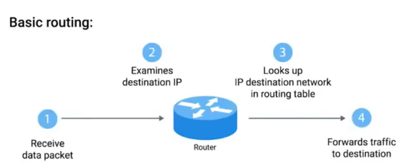
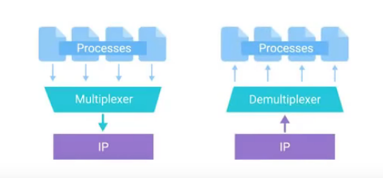
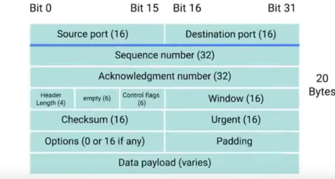
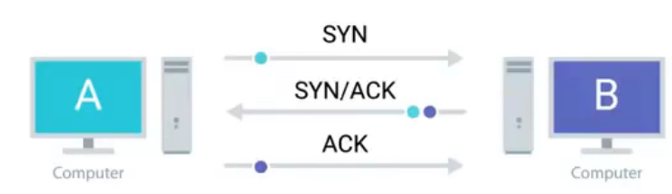
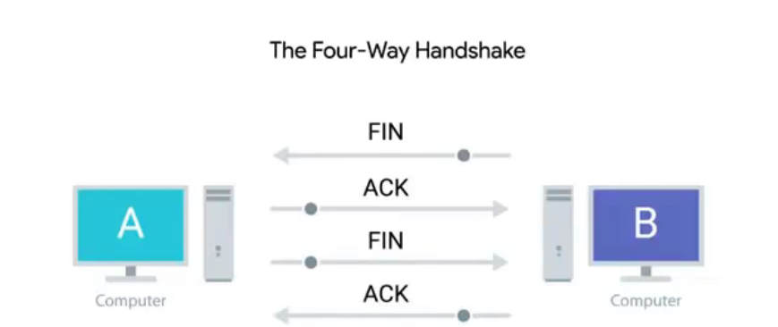

# Introduction

Slide 6 pa foton.

Gjysma e Slide 7
Slide 8, 9, gjysma 10,
40, 41-44 (pa notes), 45, 49
56, 57, 59,
60-68
~70, 71, 72, 78,
81-84, 86?, 87?
93 - 96, 97 vtm definition

## Notes
Protocol $\rightarrow$ set of stds cps must follow in order to communicate properly

Physical layer $\rightarrow$ cable connections, how signals are sent

Data link layer $\rightarrow$ defining common way of interpreting these signlas so devices can communicate
Ethernet stds also define protocols responsible for getting data to nodes on the same network or link

Network layer $\rightarrow$ Allows diff networks to communicate throught devices called routers.
A collection of such networks in called internetwork, e.g internet. Most common protocol IP. Network softw can be client (initiates req for data) or server (answering it);

Transport layer $\rightarrow$ sorts out which client and server programs are supposed to get that data.
Browser and email client apps, however email and websited go diff places. (TCP or UDP)

Application layer $\rightarrow$ app specific protocols (SMTP, http etc)

# Introduction

## Cables
Copper or fibre mostly. 1 or 0 is communicated by voltage changes.
Crosstalk issue $\rightarrow$ electr pulse on 1 wire is detected on another wire. Can have twisted pairs to prevent crosstalk. allow for duplex comm (data can go on both ways at same time). (term simplex for one side)
Fiber ones have individual optical fibers, tiny tubes of glass the width of human hair.
They use pulses of light. Used in places with a lot of elctr magn interferences. most expensive.

## Hubs, Swithes
Both primary devs to connect pcs on a single network, usually referred to as a LAN, local area network.

Hub $\rightarrow$ a dev allowing connections from many pcs at once.
Each pc sends data to all pcs in that hub, a pc then checks itself if it was meant for it or not.

Might cause *collision domain* $\rightarrow$ a network segment where only one dev can commun at a time.
If multiple systs try to send data same time , elec pulses will interfere, causing pcs to have to wait some time. Not really used not.

## Switch
Just like hub, can connect many pcs, however not a layer one dev, but layer 2 (data link). It can determine where the data was meant to be sent. Can inspect ethernet data.

## Routers
Devices that are able to forward data between independent networks.
A layer 3 device (network layer), it can inspect IP data to determine where to send data. They have routing tables on how to route traffic between lots of netw all over the world.

Small ones $\rightarrow$ home network, or offices, not detailed routing tables, purpose is to take traffic originating from home or office to the ISP (internet service provider).

Then core routers take charge, directly responsible for how we send and receive data all over the net everydate.

Core ISP routers handle a lot more traffic, and have to deal with more complexity  on making decisions on where to take traffic. Usually has many connections to many other routers.
They share data with each other using Border Gateway Protocol (BGP), which lets them learn about the most optimal paths to forward traffic. Like global guides for getting traffic to right places.

## Servers and clients
Ease way to think, server is that smth that provides data to smth requesting it. A client is what receives the data. That smth can be a node, or an individual computer withing that node. Almost all nodes are both at some point in time.

## Ethernet and mac addresses
The idea is to provide abstractions for that the other layers work the same way despite what phesical layer is used.

Ethernet solved the collision domain problem by introducing CSMA/CD. Used to determine when the comm channels are clear and when a device is free to transmit data.

How it works: If no data is currently being transmitted in the netw segment, a node will feel free to send data, if it ends up 2 or more pcs are trying to send data same time the pcs detect this collision and stops sending data .Then each dev involved in collision waits random time before trying to send data again.

We need a way to determine for which node data was meant for. Mac addr a globally unique identifier attached to a single network interface. 48 bits separated in 6 gr of 2 hex nrs.

Has 2 sections.
The first 3 octets ore OUI (organizationally unique identifier). The other three can be assigned in any way just need to make sure that address is unique. Ethernet uses this address to make sure the data is sent to the right place.

## Transmittion types

• Unicast — Single sender and a single receiver (1:1)
• Multicast — Single sender and multiple receivers (1:n)
• Concast — Multiple senders and a single receiver (m:1)
• Multipeer — Multiple senders and multiple receivers (m:n)
• Anycast — Single sender and nearest receiver out of a group of receivers
• Broadcast — Single sender and all receivers attached to a network
• Geocast — Single sender and multiple receivers in a certain geographic region

Unicast $\rightarrow$ sent from 1 device, meant for only one other dev.

If the lsb of the first octet of a destination address is 0, than the ethernet frame is meant only for that address. Sent to all dev in collision domain, but received only by dest dev.

If it is set to 1, that it is a multicast frame. One sender but many receivers.

Broadcast $\rightarrow$ sent to all address in the lan. It uses a special address called broadcast address, FF:FF:FF:FF:FF:FF.
___
A node is any physical device within a network of other tools that’s able to send, receive, or forward information. A personal computer is the most common node. It's called the computer node or internet node.
___

## Ethernet frame
Data packet $\rightarrow$ a term used for any set of binary data sent accross a network link. In ethernet level, called frame, a collection of info in a specific order.

🔲Preamble $\rightarrow$ First 7 bytes acting as buffer and can also be used to regulate speed at which data is sent. Last byte known as a 
Start Frame Delimiter (SFD), which signals the preamble is over.
🔲Dest Address $\rightarrow$ mac addr of recepient
🔲Source addss $\rightarrow$ addr where it came from
🔲Ether-type $\rightarrow$ 2 bytes and decs contents of the frame.
Instead of the one above, you can also find a 
🔲VLAN header $\rightarrow$ it indicates the frame is a vlan frame. then ether type follows it.
Stands for virtual lan $\rightarrow$ technique that lets us have mult logical lans with same physical equipment. For example you can have all companies cellphones operate on one vlan, and then all destops in another for e.g.
🔲Payload $\rightarrow$ actual data being transported, 46 to 1500 bytes long. Also contains all data from upper layers.
🔲FCS $\rightarrow$ a 4 byte frame check sequence. calculated from doing a cyclical redundency check against the frame. Used to infer if data was corrupted.

Ethernet itself only reports on data integrity, it doesnt perform data recovery.
___
# Network Layer 💻
IPv4 4 bytes in decimal sep by .
🌟 IP addr belong to networks, not devices attached to them.
When connecting a new dev to the network, a new IP address is assigned automatically to it through a techn known as Dynamic Host Configuration Protocol (DHCP).
IP assigned that way are called dynamic one.
Opposite is a static one, must be configured manually.
In most cases, static IP addrs are reserved for servers and network devices while dynamic IP addrs are reserved for clients.

## Ip datagrams and encapsulation
Ip datagram $\rightarrow$ a data packet of this layer.
2 primary section are header and payload.

🐶 Version $\rightarrow$ what ip version if used.
🐶 Header length $\rightarrow$ how long header is.
🐶 Service type $\rightarrow$ specify details about qos, quality of service. (e.g there are some routers that might classify some datagrams as more important than others).
🐶 Total length $\rightarrow$ how long the datagram is.
🐶 Identification $\rightarrow$ used to groupt messages together.
* If the data that need to be sent is larger than what 1 datagram can fit, it is split into multiple individual packets. This field is used to show that these packets belong to the same transmition.
🐶 Flag $\rightarrow$ indicates if the datagram is allowd to be fragmented or has been fragmented.
(fragmentation is the process of taking a single ip datagram and spliting into multiple ones)
🐶 Fragmentation offset $\rightarrow$ contains values that are used by the receiving end to take all parts of a fragm packet and bring them back together.
🐶 TTL, Time To Live $\rightarrow$ how many router hops a datagram can traverse before being thrown away.
Whenever that datagram reaches a new router, this field is decremented. This is used to prevent inf loops in case of misconfigurations.
🐶 Protocol $\rightarrow$ data about what transport layer protocol is being used.
🐶 Header checksum $\rightarrow$ checksum for the entire header. to check for corruption. It changes too from every hop.
🐶 Source ip $\rightarrow$ self explanatory.
🐶 Destination ip $\rightarrow$ self explanatory.
🐶 Options $\rightarrow$ used to set special characteristics for datagrams mostly for testing purposes.
🐶 Padding $\rightarrow$ 0s to insure the header has the correct total size.

🔥Encapsulation $\rightarrow$ Information of this datagram is encapsulated in the payload of an ethernet frame

## Ip Addr classes
IP addr has 2 sections, network id and host id.
🐲 Address class system $\rightarrow$ a way of defining how ip is split up
Can be A(1), B(2), C(3), D(4), E(5)
1 (if 1st bit is 0) $\rightarrow$ 1st octet for network
2 (if 1st 2 bits are 10)$\rightarrow$ 1st and 2nd for net
3 (if 1st 3 bits is 110)$\rightarrow$ ... AND 3rd for net
4 (with 1110) used for multicasting
5 the remaining ones, used for testing

## Address resolution protocol (ARP)
used to discover the hardware addr of a node with an IP addr

ARP table $\rightarrow$ a list of IP addr and the MAC addr associated with them.
When ip not in local table, an ARP broadcast is sent, and the computer with that ip sends back an ARP response with the mac address. Than it is added to the table.

## Subnetting
Spliting a network into many smaller subnetworks.
FOr the example 9.100.100.100 of class A, once the gateway router is reached for network 9.0.0.0, it is up to it to find the host, however with 16 million possible hosts, it is difficult to connect them to the same router.

## Subnet masks
Some of the part of the host id, is used for subnet id. Core router care only for net id, till it finds gateway router.
Subnet id calc by masks $\rightarrow$ 4 byte nrs as 4 octetc in decimal.
It has only consecutive ones and then 0 so that when & is applied .... (si mask normale) psh 255.255.255.0
A subnet can have 2 less than the total number of host ids available. (minus 0 and 255 as 0 not usually used and 255 is used for broadcast). However u still say 256 addresses available no 254.
if mask had 27 ones and then 5 0s it would be written as
9.100.100.100/27

## CIDR
Still there are many possible networks (some millions of class C) plus the sizes might not be right for our use.

That's where Classless Inter Domain Routing came to play.
Uses masks to demarcate(set smth off) networks. Demarcation point is where one network ends and another begins. Combines net and subnet id, uses that / notation call CIDR notation. It completely removs the concept of classes and lets an ip be defined by only 2 ids.
For example instead of having 2 C /24 networks, you can just have 1 /23.

## Basic routing concepts
Router $\rightarrow$ a device that forwards traffic depending on the destination address of the traffic.
It has at least 2 network interfaces as it need to connect to at least 2 networks to do its job.

## Routing tables
The most basic one has 4 columns

🌞Destination network $\rightarrow$ contains a row for each netw the router knows about/ It is the network id and the subnet mask in cidr notation or both in 2 separate columns. When a packet is received the router seaches for the dest network and determines in which netw it belongs. There is also a catch all entry for thoes not in the table.
🌞Next hop $\rightarrow$ the ip address of the next router that should receive data intended for the destination netw in question. Or it says it is connected and there are not other hops needed.
🌞Total hops $\rightarrow$ in complex netw, many ways to go from A to B, the shortest is always tried to be reached, and it might change all the time. Router has to keep track how far the destination is, and when receiving updated info from neighb routers it will know it a new better path is possible.
🌞Interface $\rightarrow$ it has to know which of its interfaces it should forward traffic matching the destination addr.

always updated

in order to learn about the world around them, routers use routing protocols. They 'share info' with each other
can be interior/ exterior gateway protocols

## Interior Gateway Protocols
Spling in Link state routing prot(1) and distance-vector protocols (2).
Used by routers to share info within a single autonomous system.

🌶 Autonomous system $\rightarrow$ a collection of networks that all fall under control of a single network operator. (e.g huge company with many offices each with a lan)

1 $\rightarrow$  The info of each router is propagated to every other router in the system. SO every router knows every detail about all others. More memory and more processing power required.

2 $\rightarrow$ older. a router just takes its routing table and send it to each neighbour. no info on total state of the system, only about neighbours. Slow to change when the ntw has a change far from the router

## Exterior Gateway Protocols
Used to share info on indepent autonoms systs.
Core routers need to know about auton. sys to properly forward traffic. The nr 1 goal of interent routers (core) is to get data to the edge router of an auton sys.

IANA $\rightarrow$ Internet assigned numbers authority
a non proft org that helps manage IP addr allcation
Also responsible for ASN, Autonomous system number allocation. numebr assigned to auton sustems. 32bit but as a single number not split.

## Non routable address space
RFC stands for request for comments
The name is self explanatory, it is a range of ip addresses that are set aside for use by anyone that cannot be routed to. Not every computer needs to comm with every other computer. THis allows for nodes in such networks to communicate with each other, but no gateway router will attempt to forward traffic to this type of network. These ips do not belong to anyone and can be used by anyone.

10.0.0.0/8, 172.16.0.0/12, 192.168.0.0/16 free for anyone to use for their internal netw

# Transport and application layers

## Intro
Transport lay allows traffic to be directed to specific network applications.

Applic lay allows these apps to comm in a way they understand.

## Transport layer
Can multiplex (1) and demultiplex (2)

1 $\rightarrow$ Taking a lot of 'things' and pushing them into one channel
2 $\rightarrow$ Taking them out and separating them back again

These are handled throught ports.
$\rightarrow$ a 16 bit nr used to direct traffic to specific services running on a networked computer.

FTP $\rightarrow$ file transper protocol, old methods to transfer files form one pc to another. It listens on port 21, http on 80 and soo on.

## Dissection of a tcp segment
ip datagram encapsulates a tcp segment, which has a tcpheader and data section (like payload).

🍞 Destination port $\rightarrow$ the port of the service the traffic is indended for (mentioned above).
🍞 Source port $\rightarrow$ a high nrd port chosen from a special section of ports called ephemeral ports. (needed to keep lots of outgoing connections separate. This way when data is received, it is knowed for which app it was intended)
🍞 Sequence nr $\rightarrow$ 32 bit nr used to keep track of where in a seq of tcp segments this one is expected  to be (used when data is split in many segments)
🍞 Acknowledgement number $\rightarrow$ the nr of the next expected segment
🍞 Data offset field $\rightarrow$ 4 bit indicating how lond tcp headrer is for the segment.
🍞 6 bits reserved for control flags
🍞 tcp window $\rightarrow$ specifies the range of seq nrs that might be sent before an ackn is required.
🍞 16 bit checksum $\rightarrow$ same for the whole segment.
🍞 Urgent pointer field $\rightarrow$ used together with one of the flags to show some segs might be more important
🍞 options $\rightarrow$ rarely used for complicated flow control protocols.
🍞 padding $\rightarrow$ 0s to make sure payload starts at expected location.

## TCP control flags and the 3 way handshake
As a protocol tcp estabilishes connection used to send long chains of data, in contract to lower layers that send one packet a time.
there are 6 flags:
🎃 URG (urgent) $\rightarrow$ a 1 here shows the seg is urg and the urg field has more info on this
🎃 ACK (acknowledged) $\rightarrow$ a 1 here means the acknow.. nr field should be examined
🎃 PSH (push) $\rightarrow$ the transmitting device wants the receiving dev to push currently buffered data to the app on the receiving end as soon as possible.
🎃 RST (reset) $\rightarrow$ one of the sides in a TCP connection hasn't been able to properly recover from a series of missing or malformed segments.
🎃 SYN (synchronize) $\rightarrow$ it's used when 1st estabilished a TCP connection and make sure the receiving end knows to examine the seq number field.
🎃 FIN (finish) $\rightarrow$ the transmitting end has no more data to send so connection can be closed.\

Three way handshake 

Handshake $\rightarrow$ a way for 2 devices to ensure they speak the same protocol and will be able to understand each other.

Then connection is operating in full duplex.
Each seg sent in each dir should be responded to by a seg with the ack field set

When closing the conn this happens

## TCP socket states
Socket $\rightarrow$ instatioation(actual implementation of smth defined elsewhere) of an end-point of a potential tcp conn

You can set traffic to any port you want, but you are only going to get a response only if a program has activated a socket listening on that port.

Possible socket states: 

🍏 LISTEN $\rightarrow$  a tcp socket is ready and listening for incoming connections (server-side only)
🍏 SYN_SENT $\rightarrow$ a synchronization req has been sent, but connection hasn't been yet estabilished (client side only)
🍏 SYN-RECEIVER $\rightarrow$  a socket preciously in a listen state has received a synch req and sent a SYN/ACK back (but hasn't received the final ACK yet, server-side)
🍏 ESTABILISHED $\rightarrow$  the tcp conn is in working order and both sides are free to send data to each other (on both client and server side). will be true also for other socket states following ⬇️
🍏 FIN_WAIT $\rightarrow$ a FIN has been sent, but the corresponding ACK from the other end hasn't been received yet
🍏 CLOSE_WAIT $\rightarrow$  the connection has been closed at the TCP layer, but the app that opened the socket hasn't released its hold on the socket yet
🍏 CLOSED $\rightarrow$  conn is fully terminated and no furth comm is possi

names might change with OS

## Connection oriented (1) and Connectionless protocols (2)
1 $\rightarrow$  like tcp, estabilishes a conn and uses it to ensure all data has been properly transmitted.

2 $\rightarrow$ ex. udp, it does not rely in connections. You just specify a destination port and send the packet. e.g streaming video

## Firewalls
A dev that blocks traffic that meets certain criteria
Could be used in many layers but commonly used here.
These types might be conf to block traffic from some ports and block it from other ports.

Can even run in individual hosts, not always device

## Application layer
The payload of a tcp,udp segment is the data different application are sending or requiring.

image web browser and server.
Most popular servers are Microsoft IIS, APache, nginx, but they all need to speak same protocol. This protocol is http.

## The application layer and the OSI model (open systems interconn).
Most rigorously defined, often used in academic settings. Has 7 layers. Has 2 additional layers between app and transport called session and presentation afterwards.

🌔 Session $\rightarrow$ facilitates comm between apps and trasnport layer. It is the part of  OS that takes app layer data that has been unencapsulated and hands it off to the presentation layer.
🌔 Presentation $\rightarrow$ responsible for making sure that the unencapsulated data can be understood by the apps in question. the part of OS that might handle encription and compression of data.

In our 5 layer model, the 5th layer is the last 3 here combined.

## All the layers working in unison
Check example at 2:25 afersisht

# Networking Services

## DNS domain name system
A global and highly distributed netw service that resolves strings of letter into ip addresses.

📛 domain name $\rightarrow$ a term used for smth that can be resolved by dns

## steps of name resolution
The 4 thing needed for a host to behave in a netw the expected way are 
ip addr
subnet mask
gateway for a host
dns server.

5 primary types of DNS servers:
1️⃣ caching ns (name servers)
2️⃣ recursive ns
3️⃣ root ns
4️⃣ TLD ns 
5️⃣ authoritative ns

a dns server can fulfill many of these roles at once.
:one: and :two: are generaty provided by an ISP or a local network. Their purpose is to store known domain name lookups for a certain amount of time.
:two: are ns that perform full DNS resolution requests.

all domain names in the global dns system have a TTL, which is a value in secs that can be configured by the owner of a domain name for how long a name server is allowed to cache an entry before it should discard it and perform a full resolution again.

Lets see what happens when the recursive local server need to do a full rescursive resolution.

 Contact a root ns (13 in total) which are responsible for directing queries towards the proper TLD servers.

Today they use anycast, a techniq used to route traffic to diff destintations depending on factors like location, congestion etc.

TLD $\rightarrow$ top level domain. It is the last part of any domain name. 

For each tld existant there is a tld name server but this does not mean there is only one physical server in question. Most probably a global destribution of anycast accessible servers.

Then they answer with what authorative ns to contact.
(the last 2 parts of dn), which would provide the ip for the server in question.

## DNS and Udp
DNS uses udp for the transport layer.

## Resource record types.
dns operates with a defined set of ⬆️
allow for diff kinds or name resolution to take place.
Some: 
⚽️ A record $\rightarrow$ used to point a certain dn to a certain ipv4 addr

DNS round robin -> nje dns many A records

⚽️ AAAA record $\rightarrow$ used to point a certain dn to a certain ipv6 addr

⚽️ CNAME record $\rightarrow$ redirec traff fr 1 dom nam to anoth

⚽️ MX record $\rightarrow$ mail exchange used to deliver mail at the right server

⚽️ SRV record $\rightarrow$ service record used to def locat of very speci services

⚽️ TXT record $\rightarrow$ text

## Anatomy of domain name
3 parts 
www(subdomain) . google(domain) . com(tld) = fqdn -> fully qualified domain name.
registrars -> godaddy

## DHCP
-> application layer protocol that automates the configuration process of hosts on a network.

Dyn alloc
-> a range of ip addrs set aside for client devs and 1 of them is issued when new device requests one.

Automatic alloc
-> a range of ip addrs set aside for assignment purposes.
stores to which dev gave one in the past and gives the same if possible.

Fixed alloc
-> requires a manually specified list of MAC addresses and their IPS. if not there passes to others or shuts you out.

## DHCP discovery
the process by which a client configured to use dhcp attempts to get network configuration information.

## NAT network addr translation
a teqnik
perkthe ip ne nje tj
can provide additional security to a network.

A technology that allows a gateway, usually a router or firewall to rewrite the source IP of an outgoing IP datagarm while retaining the original IP in order to rewrite it into the response.

Ndrysho source IP dhe ve te routerit ne ip datagram.
qyhet IP masquerading.

1 to * NAT -> to the world network A is protected and invisible

## Nat and the tranp shtrese
port preservation -> a technique where the source port chosen by the client is the same port used by the router.

port forwarding -> a technique where specific destination ports can be configured to always be delivered to specific nodes. 

## VPNs - virtual private networks
▶️ technology that allows for the extension of a private or local network to hosts that might not be on that local network

Two-factor authentication ▶️ a technique where more than just a username and password are required to authenticate

## Proxy Services
▶️ a server that acts on behalf of a client in order to access another service

